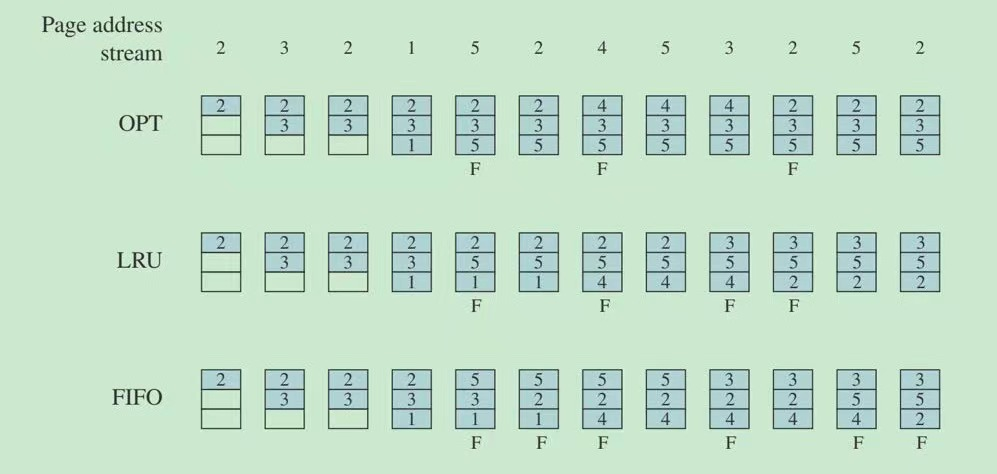
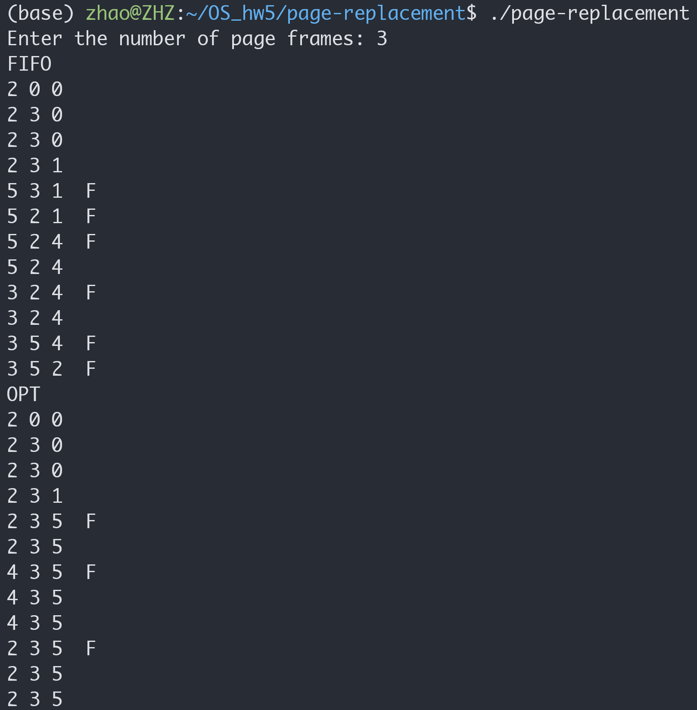
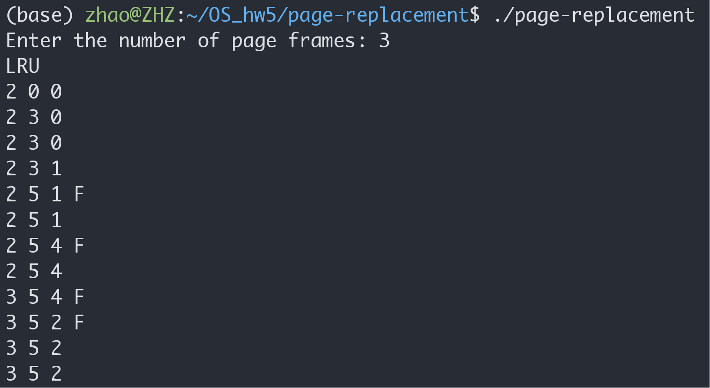
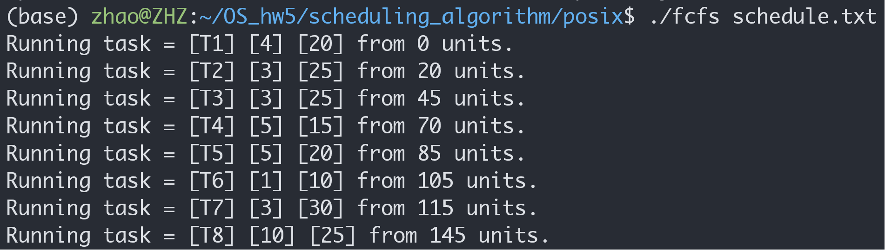
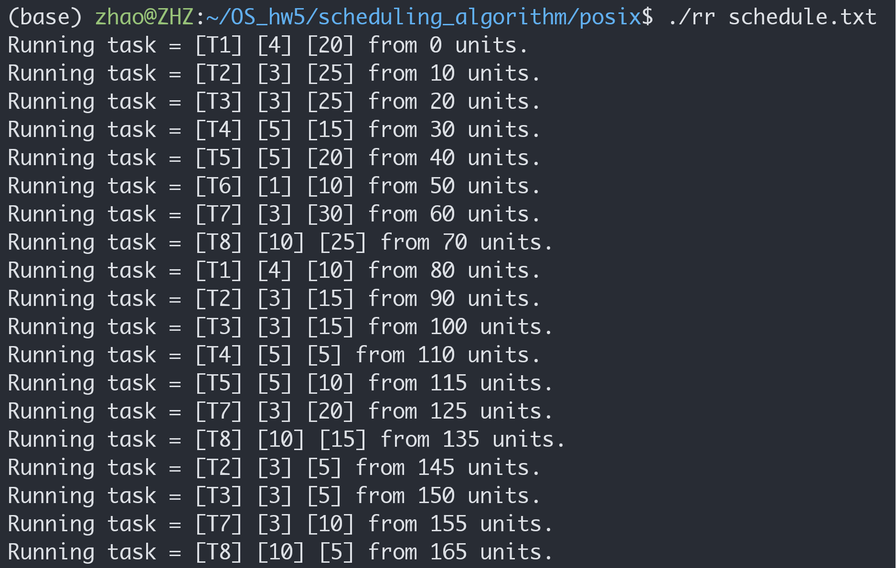
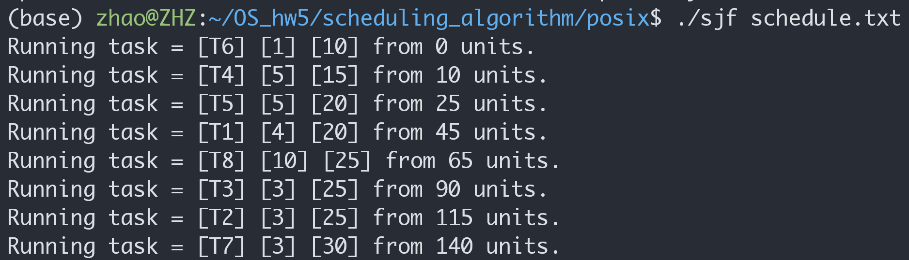
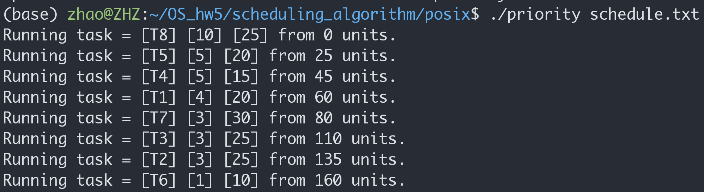
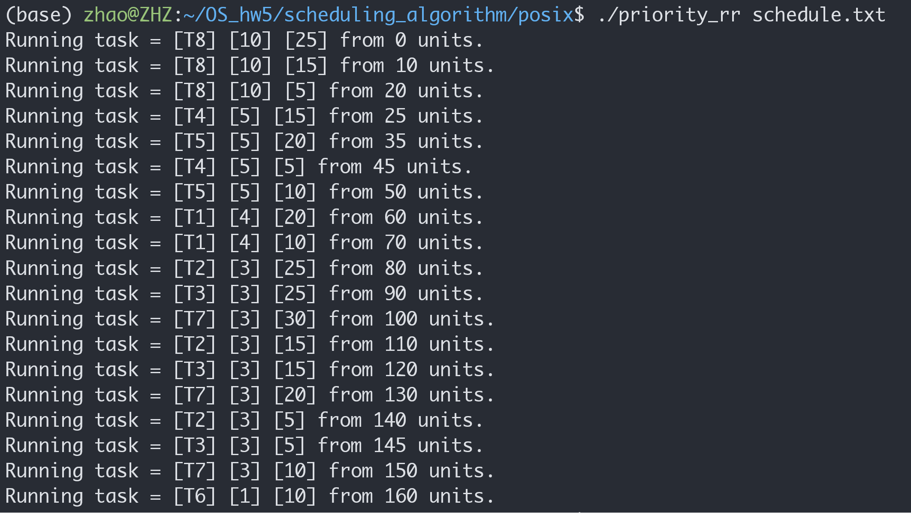

# Homework 5

## Page Replacement Algorithm

```sh
cd YOUR_DIR/os_hw5/page-replacement
make all
./page-replacement
```

The random array generated does not look so random
even if I involve the `srand` function.
For sake of convenience, I just pick one example.



The result is as follow:<br>
FIFO and OPT:<br>
<br>
LRU<br>



## Banker's Algorithm


## Scheduling Algorithm

```sh
cd YOUR_DIR/os_hw5/scheduling_algorithm/posix
make rr
make sjf
make fcfs
make priority
make priority_rr
```

Result:

<br>
<br>
<br>
<br>
<br>