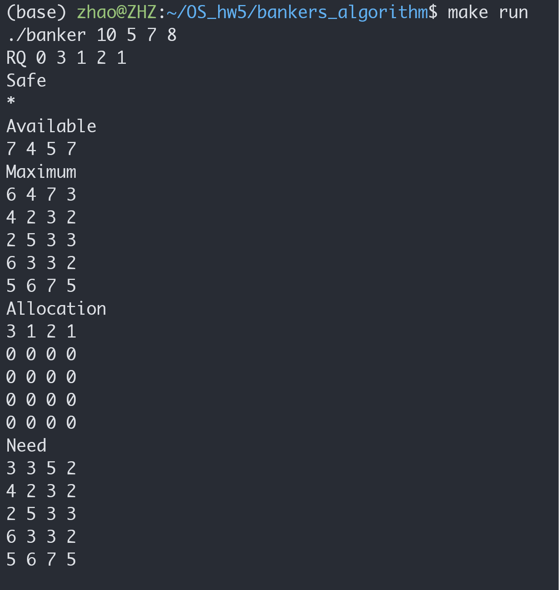
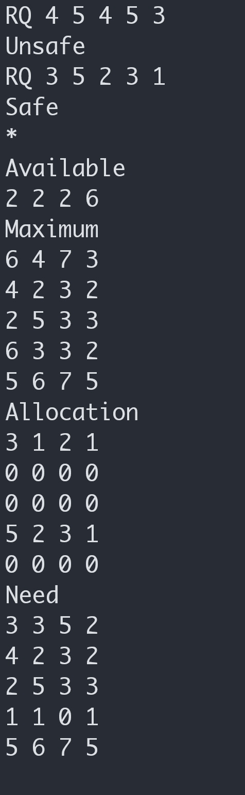
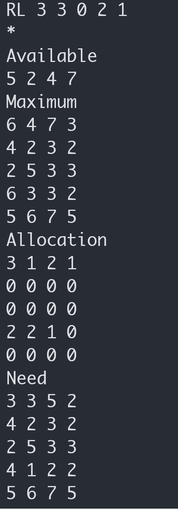
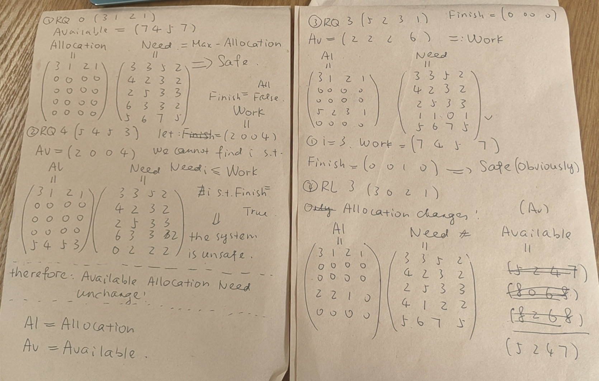

# Homework 5

```sh
.
├── README.md
├── bankers_algorithm (Chapter 8)
│   ├── Makefile
│   ├── banker.c
│   ├── banker.h
│   ├── img
│   │   ├── draft.jpg
│   │   ├── img1.png
│   │   ├── img2.png
│   │   └── img3.png
│   ├── main.c
│   └── max_requests.txt
├── page-replacement (Implementation 10.44)
│   ├── Makefile
│   ├── img
│   │   ├── check.jpg
│   │   ├── result_fifo_opt.png
│   │   └── result_lru.png
│   ├── include
│   │   ├── fifo.h
│   │   ├── lru.h
│   │   ├── opt.h
│   │   └── replacement_alg.h
│   ├── page-replacement.c
│   └── replacement_alg.c
└── scheduling_algorithm (Chapter 5)
    ├── img
    │   ├── fcfs.png
    │   ├── priority.png
    │   ├── priority_rr.png
    │   ├── rr.png
    │   └── sjf.png
    └── posix
        ├── CPU.c
        ├── Makefile
        ├── book.txt
        ├── cpu.h
        ├── driver.c
        ├── list.c
        ├── list.h
        ├── pri-schedule.txt
        ├── rr-schedule.txt
        ├── schedule.txt
        ├── schedule_fcfs.c
        ├── schedule_priority.c
        ├── schedule_priority_rr.c
        ├── schedule_rr.c
        ├── schedule_sjf.c
        ├── schedulers.h
        └── task.h

8 directories, 42 files
```

## Page Replacement Algorithm

```sh
cd YOUR_DIR/os_hw5/page-replacement
make all
./page-replacement
```

The random array generated does not look so random
even if I involve the `srand` function.
For sake of convenience, I just pick one example.


The result is as follow:<br>
FIFO and OPT:<br>
<br>
LRU<br>


## Banker's Algorithm

```sh
cd YOUR_DIR/os_hw5/bankers_algorithm
make all
make run
```


(cont.)


(cont.)


Here is my draft:


## Scheduling Algorithm

```sh
cd YOUR_DIR/os_hw5/scheduling_algorithm/posix
make rr
make sjf
make fcfs
make priority
make priority_rr
```

Result:

<br>
<br>
<br>
<br>
<br>